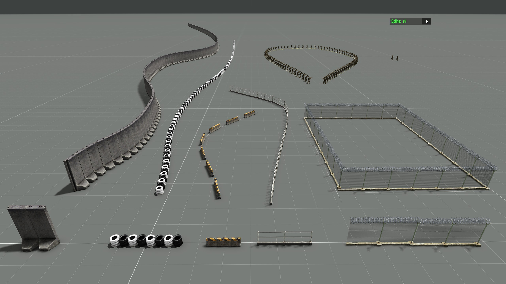
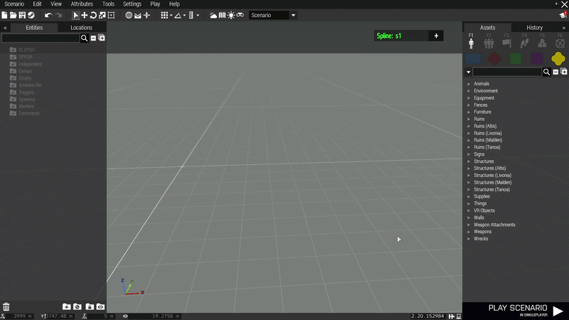
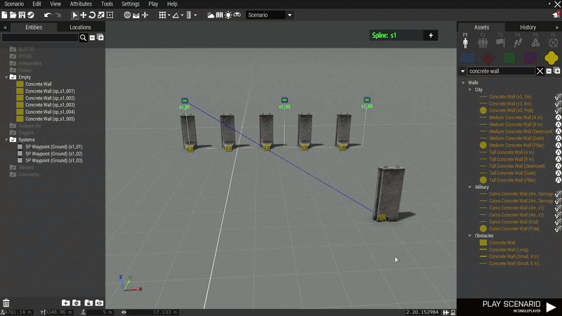
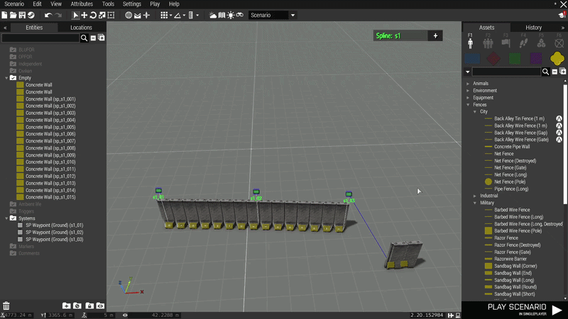
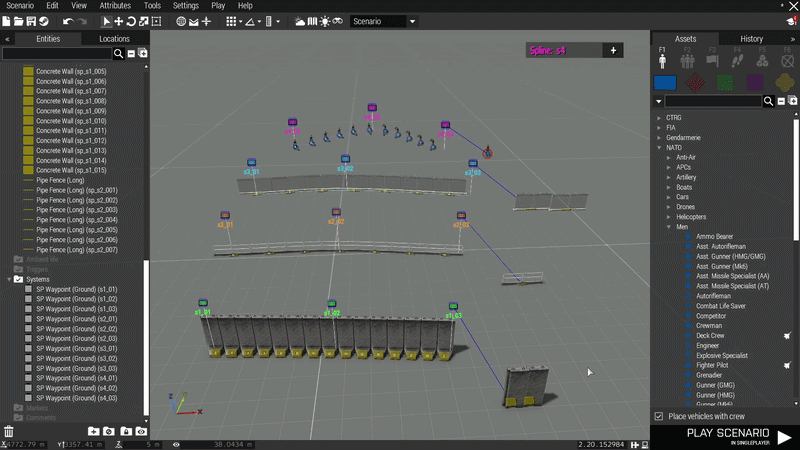
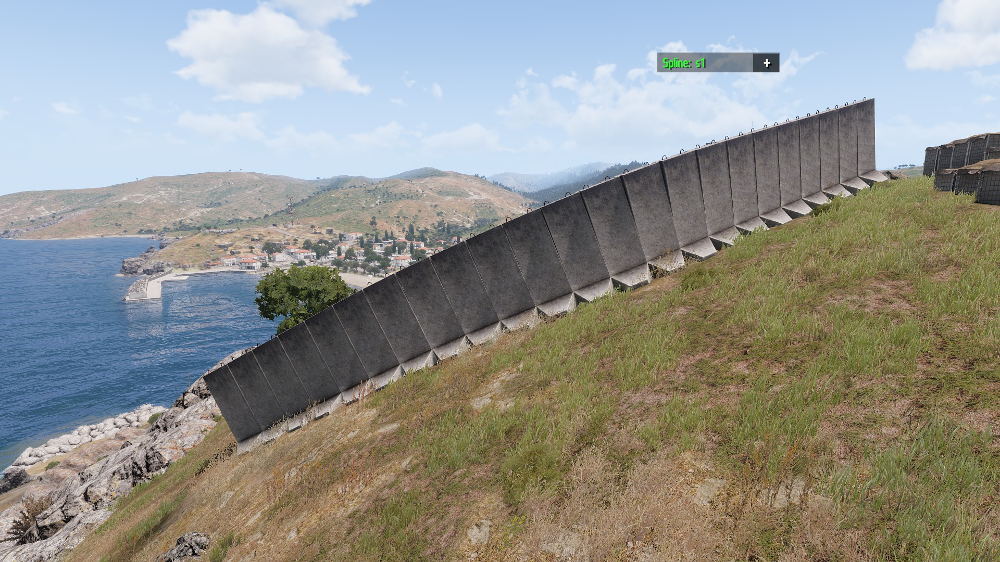
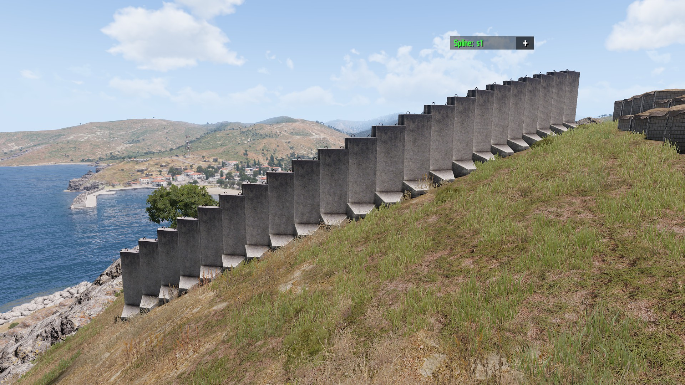

# SplinePlacer
### Eden Editor Spline Placer for Arma 3

Place objects — walls, fences, barriers, pipes, crash barriers — automatically along a smooth **Catmull-Rom spline**, with a live 3D preview that updates as you drag waypoints.

---

## Features

- **Live spline preview** in the Eden 3D viewport — updates every frame as you move waypoints
- **Arc-length parametrization** — objects are always evenly spaced regardless of curve shape
- **Multiple independent splines** — work with several spline groups simultaneously, each color-coded
- **Ref-object workflow** — sync a real scene object to any waypoint to define classname and heading offset automatically
- **Visual spacing control** — sync a second object to the ref object and drag it to set the spacing interactively, no dialog needed
- **Incremental live update** — existing objects are repositioned in-place when count matches; only deltas are created/deleted
- **Terrain snap** — Z-position locked to ground level per object (use `SP Waypoint (Ground)` type)
- **Align to spline direction** — objects automatically face along the curve
- **Auto-naming** — newly placed and duplicated waypoints are renamed automatically to `s1_01`, `s1_02`, … in the correct group
- **Session recovery** — generated objects survive Play Scenario and are re-linked on return to editor

> Players do **not** need this mod to play missions built with it.

---

## First Time Setup

---

## Spacing and Alignment

---

## Multiple Splines

---

## Extending Splines

---

## Waypoint Types

**SP Waypoint** — placed objects follow the spline's Z-position as-is.

**SP Waypoint (Ground)** — placed objects are snapped to terrain height, regardless of how the spline curves vertically.

---

## Technical Notes

- **Curve type:** Cubic Hermite spline with chord-length Catmull-Rom tangents — passes through every control point, no cusps or self-intersections
- **Arc-length parametrization:** Dense sample table built per frame; objects are walked at exact fixed intervals regardless of local curve speed
- **Ghost endpoints:** Virtual mirror points at both ends ensure the curve starts and ends tangentially at the first and last waypoint
- **Live preview:** Powered by the `Draw3D` mission event handler — zero overhead when no waypoints exist
- **Object recovery:** Generated objects are tagged with `sp_<prefix>_NNN` in their name attribute (the only field serialized to `mission.sqm` for regular objects) and are re-linked on editor reload or after Play Scenario

---

## License

Licensed under the MIT License. Credit appreciated.
